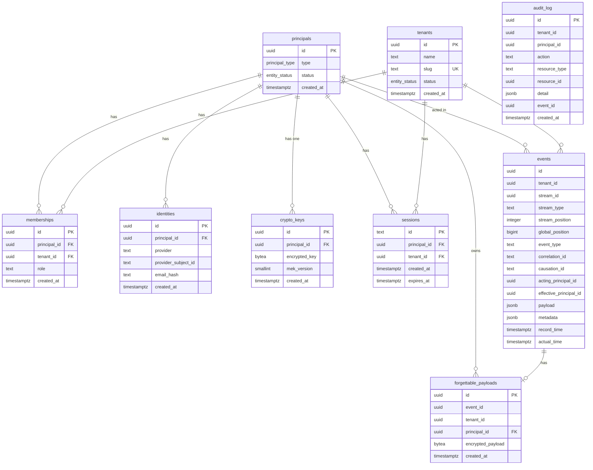

# Database Schema

## Overview

Heim uses PostgreSQL with a **co-write pattern**: CRUD tables and events are written atomically in the same transaction. CRUD tables (principals, tenants, memberships, identities) serve as the fast lookup path for queries and FK integrity. Events are the append-only immutable history and source of truth for domain state.

This avoids a chicken-and-egg problem: the `events` table is LIST-partitioned by `tenant_id`, so the tenant CRUD row (and its events partition) must exist before any events can be written for that tenant. The co-write ensures both happen atomically.

**Consistency invariant:** Every CRUD mutation MUST have a corresponding event written in the same transaction, and vice versa. If either side is written without the other, the system's consistency model is broken. This invariant should be verified by integration tests that assert 1:1 correspondence between CRUD state changes and events.

All tables live in the `public` schema. No namespace prefixes.

## Custom Types

**`principal_type`** — Postgres ENUM: `'user'`, `'system'`. Extensible later via `ALTER TYPE` to add `'service'`, `'group'`.

**`entity_status`** — Postgres ENUM: `'active'`, `'deleted'`. Used by principals and tenants for logical delete. Extensible later to add `'suspended'`.

## Tables

### `principals`

The core identity anchor. Every FK pointing to "who did this" references this table. Not scoped to any tenant — a principal exists independently and can belong to multiple tenants (or none).

| Column       | Type             | Notes                        |
| ------------ | ---------------- | ---------------------------- |
| `id`         | UUID PK          | `gen_random_uuid()`          |
| `type`       | `principal_type` | Required                     |
| `status`     | `entity_status`  | Required, default `'active'` |
| `created_at` | timestamptz      |                              |

No `tenant_id`. No version column — concurrency is handled at the event store level via `stream_position` uniqueness.

Status `'deleted'` is a logical delete. The row is preserved because it's FK-referenced by events, memberships, identities, etc. Queries should filter on `status = 'active'` by default.

### `tenants`

| Column       | Type            | Notes                                                                                |
| ------------ | --------------- | ------------------------------------------------------------------------------------ |
| `id`         | UUID PK         | `gen_random_uuid()`                                                                  |
| `name`       | text            | Required, not unique (two families can share a name). Co-written with events.        |
| `slug`       | text            | Required, unique. URL-safe identifier for subdomains/routes (e.g. `'smith-family'`). |
| `status`     | `entity_status` | Required, default `'active'`                                                         |
| `created_at` | timestamptz     |                                                                                      |

No `created_by` FK — the creator is captured in the co-written event's `acting_principal_id`.

Status `'deleted'` is a logical delete. The row is preserved because it's FK-referenced by events (partition key), memberships, etc. Queries should filter on `status = 'active'` by default.

### `memberships`

Links principals to tenants with a role.

| Column         | Type                   | Notes               |
| -------------- | ---------------------- | ------------------- |
| `id`           | UUID PK                | `gen_random_uuid()` |
| `principal_id` | UUID FK → `principals` | Required            |
| `tenant_id`    | UUID FK → `tenants`    | Required            |
| `role`         | text                   | Required            |
| `created_at`   | timestamptz            |                     |

`role` is application-validated by the ABAC policy engine, not a DB enum. Roles are a domain concern, not infrastructure.

**Constraints:** unique on `(principal_id, tenant_id)`.
**Indexes:** on `tenant_id` for "list all members of tenant" queries.

No soft delete — removal deletes the row. History lives in events.

### `identities`

Connects principals to external identity providers (Google, Apple).

| Column                | Type                   | Notes                                                                                   |
| --------------------- | ---------------------- | --------------------------------------------------------------------------------------- |
| `id`                  | UUID PK                | `gen_random_uuid()`                                                                     |
| `principal_id`        | UUID FK → `principals` | Required                                                                                |
| `provider`            | text                   | Required (e.g. `'google'`, `'apple'`). Not an enum — providers are an open set.         |
| `provider_subject_id` | text                   | Required. The provider's `sub` claim, stored in cleartext (opaque identifier, not PII). |
| `email_hash`          | text                   | Nullable. HMAC-SHA256 of normalized email, hex-encoded.                                 |
| `created_at`          | timestamptz            |                                                                                         |

**Constraints:** unique on `(provider, provider_subject_id)`.
**Indexes:** on `email_hash` for cross-provider merge lookups; on `principal_id` for "list identities for principal".

`email_hash` is null when the provider didn't supply a verified email. Merging (step 4 of the login flow) only applies to identities that have a hash.

**Email hashing:** emails are normalized (lowercased, trimmed) then HMAC-SHA256'd with a server-side secret (`EMAIL_HMAC_KEY` env var). The hash is hex-encoded (64 chars). This allows matching across providers without storing cleartext email. If the key is rotated, all hashes must be recomputed in a batch migration. The rotation migration must be idempotent and incremental (track progress via a `hash_version` column or similar marker so partial runs can resume).

> **Threat model note:** The HMAC is unsalted. If `EMAIL_HMAC_KEY` is compromised, an attacker can precompute hashes for targeted email addresses and correlate identities across providers. At household scale (dozens of users), adding per-identity salts would make merge lookups require computing a candidate hash against every existing salt — negligible at this scale but architecturally complex. This is an accepted tradeoff. If the user base grows significantly or the threat model changes, migrate to salted hashes with an index on `(salt, email_hash)`.

### `sessions`

Server-side sessions for authenticated users. Each session is identified by an opaque crypto-random token stored in an HTTP-only cookie.

| Column         | Type                   | Notes                                                                                       |
| -------------- | ---------------------- | ------------------------------------------------------------------------------------------- |
| `id`           | text PK                | Opaque crypto-random token (32 bytes, base64url-encoded). Not UUID — must be unpredictable. |
| `principal_id` | UUID FK → `principals` | Required                                                                                    |
| `tenant_id`    | UUID FK → `tenants`    | Nullable. Active tenant for the session. Set on login or via tenant switch.                 |
| `created_at`   | timestamptz            |                                                                                             |
| `expires_at`   | timestamptz            | Required. Application enforces expiry on lookup.                                            |

**Indexes:** on `principal_id` for "list/invalidate all sessions for a principal"; on `expires_at` for cleanup of expired sessions.

No RLS — sessions are cross-tenant like `principals`, `identities`, and `crypto_keys`. Access control is application-layer. No soft delete — logout deletes the row, history lives in `audit_log`.

### `events` (partitioned)

The event store. Bitemporal, LIST-partitioned by `tenant_id`. Each tenant gets its own partition, created atomically in the same transaction that inserts the tenant CRUD row.

| Column                   | Type                   | Notes                                                                                                                                           |
| ------------------------ | ---------------------- | ----------------------------------------------------------------------------------------------------------------------------------------------- |
| `id`                     | UUID                   | Required                                                                                                                                        |
| `tenant_id`              | UUID FK → `tenants`    | Required. Partition key.                                                                                                                        |
| `stream_id`              | UUID                   | Required. The aggregate instance ID.                                                                                                            |
| `stream_type`            | text                   | Required. Aggregate type name (e.g. `'User'`, `'Tenant'`).                                                                                      |
| `stream_position`        | integer                | Required. 1-based position within this stream. Set by the command handler.                                                                      |
| `global_position`        | bigint                 | Populated from a shared `SEQUENCE` (`events_global_position_seq`). Provides a total order across all tenants for full-system replay.            |
| `event_type`             | text                   | Required (e.g. `'UserCreated'`, `'TenantRenamed'`).                                                                                             |
| `correlation_id`         | text                   | Required. Assigned when a command enters the system, propagated to all resulting events. Groups an entire causal chain from one user action.    |
| `causation_id`           | text                   | Required. What directly caused this event. Format: `"command:<uuid>"` or `"event:<uuid>"`. Forms a linked list back to the originating command. |
| `acting_principal_id`    | UUID FK → `principals` | Required. The principal who actually performed the action.                                                                                      |
| `effective_principal_id` | UUID FK → `principals` | Nullable. The principal being impersonated. Null when not impersonating (acting as self).                                                       |
| `payload`                | jsonb                  | Required. Domain event data. Sensitive fields go in `forgettable_payloads` instead.                                                             |
| `metadata`               | jsonb                  | Default `{}`. Optional infrastructure context: source IP, user agent, request ID, feature flags, etc.                                           |
| `record_time`            | timestamptz            | System-set, immutable. When the event was stored.                                                                                               |
| `actual_time`            | timestamptz            | Command-set. When it happened in the real world.                                                                                                |

> **PII guardrail:** The `metadata` field MUST NOT contain PII. It is for infrastructure context only. The application layer validates metadata against a schema before writing. A `CHECK` constraint on `octet_length(metadata::text) < 8192` acts as a size safety net against malformed payloads.

**Sequence:** `events_global_position_seq` is a single shared `SEQUENCE` used across all partitions. `nextval()` doesn't hold row locks, so it won't bottleneck writes. This gives a strict total ordering across all tenants — essential for full-system replay (`SELECT * FROM events ORDER BY global_position`) and cross-tenant projections. The sequence uses `CACHE 20` (or higher) to reduce contention — each backend pre-allocates a block of values. Gaps from unused cached values on crash are acceptable since `global_position` is for ordering, not counting.

**PK:** `(tenant_id, global_position)` — partition key must be part of PK in Postgres.
**Unique constraints:** `(tenant_id, stream_id, stream_position)` — this is the optimistic concurrency control. Two concurrent writers appending to the same stream position get a unique violation. `(tenant_id, id)` — needed as a FK target for `forgettable_payloads`.
**Indexes:** `(tenant_id, record_time)` for bitemporal "as-of" queries; `(tenant_id, actual_time)` for bitemporal "what was true at real-world time X" queries; `(tenant_id, event_type)` for projection subscriptions filtered by type; `(tenant_id, correlation_id)` for "show me everything from this user action".

Note: the unique constraint on `(tenant_id, stream_id, stream_position)` is implemented by Postgres as a B-tree index. This covers the primary aggregate loading query (`WHERE tenant_id = ? AND stream_id = ? ORDER BY stream_position`) — no additional index is needed for this pattern.

### `forgettable_payloads`

Stores sensitive/encrypted data separately from events so it can be "forgotten" via crypto shredding — delete the encryption key and the data becomes permanently unreadable. Based on the [forgettable payloads](https://verraes.net/2019/05/eventsourcing-patterns-forgettable-payloads/) and [throw away the key](https://verraes.net/2019/05/eventsourcing-patterns-throw-away-the-key/) patterns.

When a consumer reads an event, it fetches the corresponding payload and decrypts it with the principal's key. If the key has been deleted, the payload is unreadable — the data is effectively forgotten.

| Column              | Type                   | Notes                                                                                 |
| ------------------- | ---------------------- | ------------------------------------------------------------------------------------- |
| `id`                | UUID PK                | `gen_random_uuid()`                                                                   |
| `event_id`          | UUID                   | Required.                                                                             |
| `tenant_id`         | UUID                   | Required.                                                                             |
| `principal_id`      | UUID FK → `principals` | Required. Determines which encryption key was used. This is the "forget me" axis.     |
| `encrypted_payload` | bytea                  | Required. Encrypted sensitive data (e.g. email, display name, provider profile info). |
| `created_at`        | timestamptz            |                                                                                       |

**FK:** `(tenant_id, event_id)` → `events(tenant_id, id)`. Composite because the events table is partitioned — requires a unique constraint on `events(tenant_id, id)`. The composite FK works correctly across matching partitions.
**Constraints:** unique on `event_id` — one forgettable payload per event (each event's sensitive data belongs to a single principal).
**Indexes:** on `principal_id` for "forget this principal"; on `tenant_id` for "forget this tenant".

**Partitioning:** `forgettable_payloads` is LIST-partitioned by `tenant_id`, mirroring the `events` table. Partitions are created atomically alongside the corresponding `events` partition when a tenant is created. This enables partition-wise joins during tenant-scoped projection rebuilds — Postgres joins matching partitions directly rather than scanning the full table.

No `updated_at` — payloads are immutable once written (append-only, like events).

### `crypto_keys`

Per-principal encryption keys for forgettable payloads.

| Column          | Type                   | Notes                                                                                                                                                                           |
| --------------- | ---------------------- | ------------------------------------------------------------------------------------------------------------------------------------------------------------------------------- |
| `id`            | UUID PK                | `gen_random_uuid()`                                                                                                                                                             |
| `principal_id`  | UUID FK → `principals` | Required, unique — one key per principal.                                                                                                                                       |
| `encrypted_key` | bytea                  | Required. The data encryption key (DEK), encrypted with the current master encryption key (MEK).                                                                                |
| `mek_version`   | smallint               | Required. Identifies which MEK version was used to encrypt this DEK. Enables gradual MEK rotation — re-encrypt DEKs in batches, track progress via `WHERE mek_version = <old>`. |
| `created_at`    | timestamptz            |                                                                                                                                                                                 |

**Encryption model:** 2-tier MEK → DEK. Each principal has one DEK (stored here, encrypted by the MEK). The MEK (master encryption key) is a server-side secret, separate from the `EMAIL_HMAC_KEY` used for email hashing. A per-tenant KEK tier was considered but rejected — principals span tenants, so mapping DEKs to tenant-scoped KEKs would require multiple DEKs per principal.

The MEK MUST be stored in a KMS (AWS KMS, GCP Cloud KMS, or HashiCorp Vault) in production. The application never holds the MEK in memory — it sends the encrypted DEK to the KMS for unwrapping. For local development (Docker Compose), a file-based or env var fallback is acceptable, but the application code must use the same KMS abstraction interface.

The MEK and `EMAIL_HMAC_KEY` MUST be separate secrets with independent access controls. A single compromise should not expose both the encryption hierarchy and the identity correlation mechanism.

**Key loss:** If the MEK is lost, all forgettable payloads become permanently unreadable. This is identical to the crypto shredding outcome but unintentional. The MEK must have a documented backup/escrow procedure. This procedure should be specified in operational documentation before production deployment.

**MEK rotation:** the application decrypts each DEK with the old MEK (identified by `mek_version`) and re-encrypts it with the new MEK, updating `mek_version` accordingly. Progress is trackable via `WHERE mek_version = <old>`.

**Forgetting data:** two complementary mechanisms, both application-driven:

- **Forget a principal:** delete their `crypto_keys` row. All their `forgettable_payloads` become permanently unreadable (crypto shredding). After deleting the `crypto_keys` row, a background job MUST physically delete the principal's `forgettable_payloads` rows within a defined SLA (e.g., 24 hours). The encrypted payloads are already unreadable, but the remaining metadata (`principal_id`, `tenant_id`, `event_id`, `created_at`) constitutes a data trail that should not be retained.
- **Forget a tenant:** `DELETE FROM forgettable_payloads WHERE tenant_id = X`. This is why `tenant_id` is denormalized onto forgettable payloads — it enables tenant-level deletion without joining through events.

In both cases, the events themselves remain intact — only the sensitive portions are lost.

### `audit_log`

Flat, append-only table for observability. Captures two kinds of entries:

1. **Infrastructure events** not in the business event store: login attempts, token refreshes, identity linking — security/observability concerns.
2. **Audit shadows** of business events: when a business event is co-written, a simplified audit row is written in the same transaction.

| Column          | Type        | Notes                                                                              |
| --------------- | ----------- | ---------------------------------------------------------------------------------- |
| `id`            | UUID PK     | `gen_random_uuid()`                                                                |
| `tenant_id`     | UUID        | Nullable. Null for system-level entries (e.g. failed login before tenant context). |
| `principal_id`  | UUID        | Required. The system principal is used for system-level actions.                   |
| `action`        | text        | Required. Dot-namespaced (e.g. `'user.logged_in'`, `'tenant.created'`).            |
| `resource_type` | text        | Nullable (e.g. `'principal'`, `'tenant'`, `'membership'`).                         |
| `resource_id`   | UUID        | Nullable. The affected resource's ID.                                              |
| `detail`        | jsonb       | Default `{}`. Additional context (IP, user agent, provider name, etc.).            |
| `event_id`      | UUID        | Nullable. Links to the business event if this is an audit shadow.                  |
| `created_at`    | timestamptz |                                                                                    |

**Indexes:** `(tenant_id, created_at)` for "audit log for this tenant"; `(principal_id, created_at)` for "everything this principal did"; `(action)` for filtering by type.

No FKs enforced — append-only observability table, decoupled from other table lifecycles. No soft delete — retention policy (time-based cleanup) is the deletion mechanism.

> **PII guardrail:** The `detail` field MUST NOT contain PII. The application layer enforces this via a typed builder that only permits an explicit allow-list of fields (e.g., `ip`, `user_agent`, `provider`, `request_id`). Note that IP addresses are PII under GDPR — the retention policy must account for this, and the "forget a principal" flow should scrub or anonymize their audit log entries.

Write volume is low — entries come from auth actions (login, logout, token refresh, identity linking) and audit shadows of CRUD mutations. The table starts unpartitioned. If retention cleanup or table size warrants it, range-partition by `created_at` (monthly) later for instant `DROP PARTITION` retention.

## Shared Conventions

- All PKs are UUIDs (`gen_random_uuid()`)
- All timestamps are `timestamptz`
- No PII in cleartext anywhere
- Principals and tenants use `entity_status` for logical delete — rows are preserved because they're FK-referenced. Queries filter on `status = 'active'` by default.
- Memberships and identities use hard delete — history lives in events.
- Foreign keys on CRUD tables, on `events` (`tenant_id`, `acting_principal_id`, `effective_principal_id`), and on `forgettable_payloads` (`(tenant_id, event_id)` → events, `principal_id` → principals). No FKs on `audit_log` (fully decoupled).

## Row-Level Security

RLS is enabled on `events`, `forgettable_payloads`, `memberships`, and `audit_log`. Each request transaction sets `SET LOCAL app.current_tenant_id = '<uuid>'` before any queries. The policy predicate is:

```sql
USING (tenant_id = current_setting('app.current_tenant_id')::uuid)
```

System-level operations (migrations, projection rebuilds, global replay) use a dedicated database role with `BYPASSRLS` privilege.

The `principals`, `identities`, `crypto_keys`, and `sessions` tables are cross-tenant by design and do NOT have tenant-scoped RLS. Access control for these is application-layer only.

LIST partition pruning makes the RLS predicate essentially free — Postgres prunes to the correct partition first, then the RLS check is trivially true for every remaining row. RLS also acts as insurance against a future partitioning strategy change (e.g., migration to hash partitioning).

## Bootstrap / Seeding

The system needs a well-known system principal before any user operations can occur. Created via the initial migration (not via events):

- **System principal** — `00000000-0000-0000-0000-000000000001`, type `'system'`. Visually distinctive in logs and queries, avoids the nil UUID (`...000`) which many libraries treat as null. Acts as the `acting_principal_id` for bootstrap operations, migrations, and system-initiated actions.

> **Security invariant:** The system principal MUST NOT be usable as an `acting_principal_id` via any user-facing code path. Command handlers MUST reject commands where the acting principal is the system principal unless the command originates from an internal system process (migration, background job, scheduled task). This is enforced at the command handler level, not by database constraints.

No system tenant is needed. Principal creation is CRUD + audit_log only (not event-sourced). Tenant creation co-writes the tenant CRUD row with its events partition and a `TenantCreated` event in that partition. Identity linking and other domain events happen after a tenant exists, so there are no tenant-less events.

## Scaling Notes

**Partition strategy migration trigger:** If the number of tenants exceeds ~500, evaluate migrating the `events` table from LIST partitioning to hash partitioning with a fixed bucket count (e.g., 64 or 128). Hash partitioning preserves single-partition queries for tenant-scoped operations while bounding partition count. The migration path requires changing the tenant creation flow (no DDL per tenant) and tenant deletion flow (explicit `DELETE` + background cleanup instead of `DROP PARTITION`). RLS continues to enforce tenant isolation regardless of partitioning strategy.

## Relationships



`audit_log` has no FK relationships — it references `tenant_id`, `principal_id`, and `event_id` by value but is intentionally decoupled.
